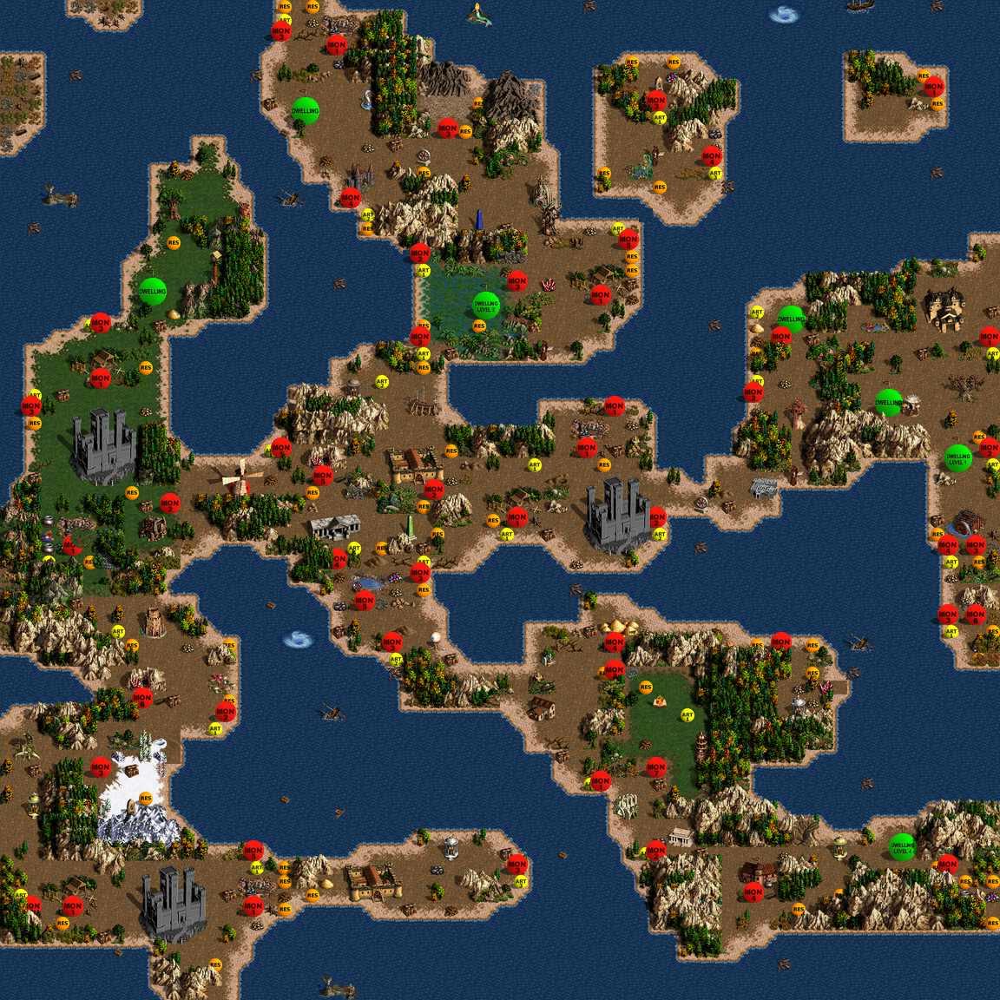
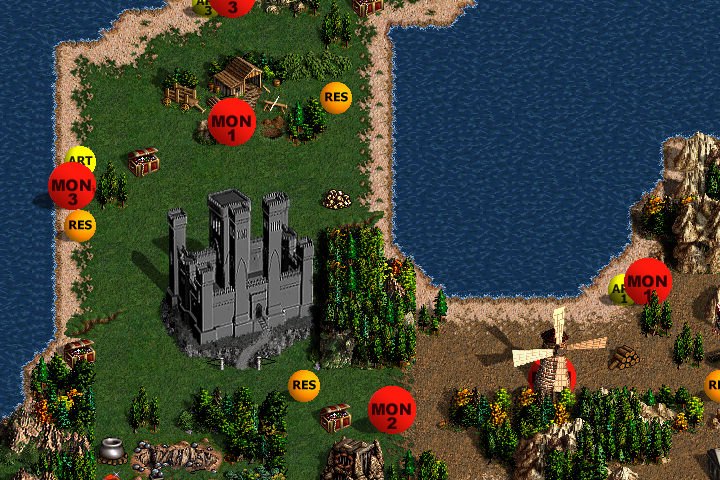

# vcmi-mapgen

Procedural map generation for [VCMI](https://vcmi.eu) (the open-source Heroes of
Might & Magic III engine), learned from a corpus of 159 real maps. It generates
**playable `.vmap` maps** — terrain, towns, mines, creature dwellings, guarded
treasure, vegetation — that you can open in the VCMI editor and play right away.



*A 72×72 two-player island map generated from a single seed
(`zone_engine generate --layout pp --seed 7 --size 72 --water-mode islands --players 2`)
and rendered with the real H3 sprites, exactly as the VCMI editor shows it.*

The colored discs are the editor's genuine **random-object** sprites (random
monster / artifact / resource / town, by level band) — VCMI rolls them when the
game starts, so every playthrough of a generated map is different while the
economy and guard strength stay balanced.



## How it works

Everything is **learned from real maps** (`maps/`, 159 classic `.h3m` maps) and
**deterministic** (same seed ⇒ bit-identical map):

1. **Macro layout** — capacity-constrained zone growth with textured borders,
   optional ocean/islands, and an optional underground level connected by
   Subterranean Gate pairs.
2. **Terrain** — corpus-learned transition tiles (shores, terrain edges) so
   coastlines and terrain borders look hand-drawn.
3. **Gameplay layer** — towns, mines, dwellings and shrines placed with
   corpus-fitted densities; every town gets its sawmill and ore pit; gold mines
   scale with the number of towns; a protected walkable web guarantees every
   object stays reachable (validated, not hoped for).
4. **Vegetation** — a corpus-fitted Gibbs marked point process scatters trees,
   rocks and lakes with the same clustering statistics as the real maps.
5. **Loot** — unguarded scatter along routes, guarded caches in pockets with a
   monster on the mouth; guard level scales with the guarded value.

## Requirements

- [`uv`](https://docs.astral.sh/uv/) — run everything through `uv run`; it
  resolves the environment (Pillow + numpy, the rest is stdlib).
- A local **VCMI install with the Heroes III data files** — used for sprite
  rendering and as the `.vmap` header template. The standard per-OS locations
  are auto-detected (Linux flatpak `~/.var/app/eu.vcmi.VCMI/data/vcmi`, Linux
  `~/.local/share/vcmi`, macOS `~/Library/Application Support/vcmi`, Windows
  `Documents/My Games/vcmi`); point the `VCMI_HOME` environment variable at the
  `vcmi` data directory if yours lives elsewhere.

## Generate maps

```bash
# One 72x72 two-player island map -> PNG render in out/render/pp/, playable
# .vmap in out/vmap/ (each player slot is wired to its own starting town, so
# the map is playable immediately — victory: defeat all)
uv run python -m vcmi_mapgen.zone_engine generate --layout pp \
    --seed 7 --size 72 --water-mode islands --players 2

# Two levels: surface + underground, linked by subterranean gates
uv run python -m vcmi_mapgen.zone_engine generate --layout pp \
    --seed 3 --size 72 --subterrain

# 4 players in two teams
uv run python -m vcmi_mapgen.zone_engine generate --layout pp \
    --seed 5 --size 108 --players 4 --teams 2v2
```

## The zone-rebuilding engine

The second half of the project: given a **real** map, segment it into
same-terrain zones, record each zone's object pattern in a shape-relative
frame, and *replay* it onto a target shape.

- **Same shape ⇒ bit-exact reproduction** — integer-only replay, verified
  2027/2027 objects on *All for One*; relational objects (portal pairs, quest
  links) survive because identity is never re-rolled.
- **Larger shape ⇒ the same objects at the same relative placement** on a
  larger tile grid. VCMI objects are fixed-size tile objects, so positions
  scale while footprints don't — no illegal overlaps, gameplay stays reachable.

```bash
uv run python -m vcmi_mapgen.zone_engine run "All for One"        # extract -> rebuild -> verify -> render
uv run python -m vcmi_mapgen.zone_engine rebuild "All for One" --identity --verify
uv run python -m vcmi_mapgen.zone_engine reconstruct "All for One" --zone 7 --deform
uv run python -m vcmi_mapgen.markov_terrain                       # learned terrain generator
```

## Layout

```
vcmi_mapgen/        the Python package (generator + engine + renderer + data pipeline)
  pipeline.py         MapState / PipelineStep / VcmiMapGenPipeline / PlacementWorkspace
  steps/              the generator, as 8 pipeline steps run in order — each a folder
                      with its own step.py + private logic modules + *_test.py:
    terrain_gen/        macro zone layout: capacity-constrained growth, water, borders
    tile/               corpus-learned autotiling (despeckle + H3-correct transition views)
    segment/            same-terrain flood-fill zone segmentation
    gate/               Subterranean Gate pairs (--subterrain)
    gameplay/           towns/mines/dwellings placement (corpus densities) + water bodies
    vegetation/         corpus-fitted Gibbs marked point process (trees, rocks, lakes)
    pickup/             loot: unguarded scatter + the loot-zone access mechanic
    repair/             G2 repair, island fill, portal rescue, pocket caches, border seal
  renderers/          PngRenderer (H3 sprites) / VmapRenderer (playable .vmap export)
  readers/            VmapReader (read back a generated/authored .vmap)
  zone_engine.py      zone-rebuild + generate CLI: extract / inspect / reconstruct /
                      rebuild / run / generate (--layout pp = the pipeline above)
  terrain_segment.py  same-terrain flood-fill segmentation + interior-depth features
  ontology.py         object identity, footprints, terrain coupling (single source of truth)
  obj_resolve.py      faithful-map loader, footprint mask expansion
  faithful.py         faithful map dict -> editor-valid .vmap
  render_editor.py    editor-quality 32px H3 sprite rendering (decodes DEF fmt 0/1/2/3)
  markov_terrain.py   terrain generator: Markov chain learned from the corpus
  h3m.py, vcmi_ids.py, h3m2vmap.py, extract_faithful.py   .h3m -> faithful JSON pipeline
  vmapwrite.py, traverse.py                                .vmap writer + reachability
  vcmi_paths.py       locates the VCMI data dir per-OS (override: VCMI_HOME)
maps/               the .h3m corpus (159 real maps) — source data
maps_json/          faithful JSON per map (the engine's input; regenerable from maps/)
data/               corpus-derived priors and fitted statistics
docs/               specs, architecture, and the VCMI H3M format reference notes
vcmi-h3m-format-reference/   verbatim VCMI C++ sources documenting the .h3m format
out/                transient outputs (renders, .vmaps) — gitignored
```

## Tests

```bash
uv run pytest
```

Covers the sprite renderer (all four H3 DEF formats, golden rebuilt==source
pixel identity), the point-process sampler (determinism, protected-web
legality), gameplay placement rules, and `.vmap` export contracts. Tests that
need the H3 data files skip when no VCMI install is present.
